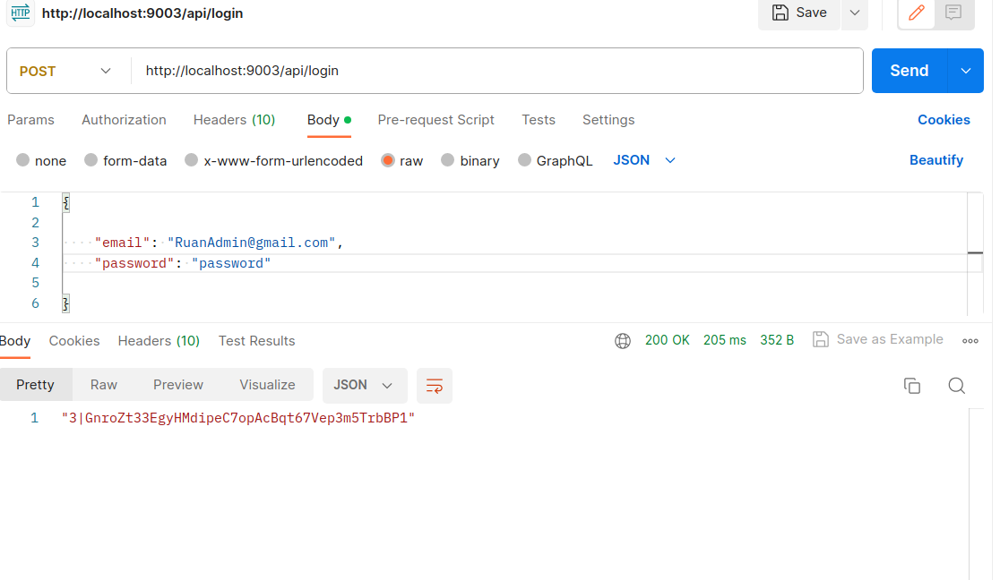
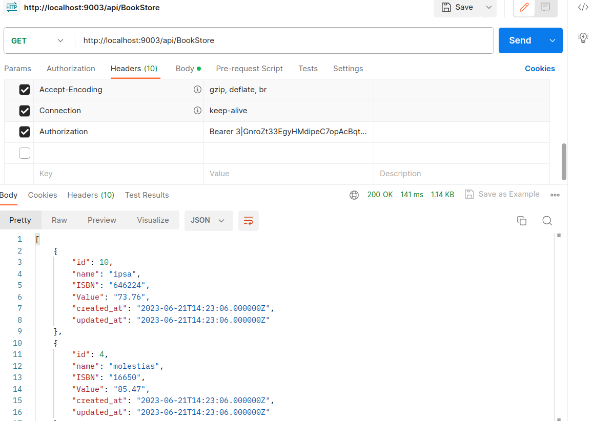

# API BookStore

Teste em Laravel.

```bash
php: 8.1
laravel: 10


Usuário default para autenticação do JWT após rodar as seeds

email: RuanAdmin@gmail.com
password: password
```


## Iniciando

Clone o projeto, usando o comando abaixo (usando HTTPS):

```bash

git clone https://github.com/RuanSilva6721/BookStoreApi.git
```


Depois de clonar, acesse o repositório e instale as dependências com os comandos abaixo (para isso, utilize o [Composer](https://getcomposer.org/) ):

```bash

composer install
```


Após instalar as dependências, duplique o arquivo `.env.example` e renomeie um deles para `.env`.

Gere uma nova chave da aplicação:

```bash

php artisan key:generate
```


Altere as configurações no arquivo `.env` para que o projeto se conecte ao banco de dados.


Execute o comando abaixo para que as tabelas sejam criadas no banco de dados:

```bash

php artisan migrate
```


Inicie o servidor da aplicação com o comando:

```bash

php artisan serve
```


Para ver o projeto em execução, acesse [http://localhost:8000](http://localhost:8000/) .

Caso queira adicionar dados fictícios:

```bash

php artisan db:seed & php artisan db:seed --class=BookStoreSeeder
```


Caso queira fazer testes unitário e de integração:

```bash

php artisan test
```


**Caso queira rodar em Docker, utilize o comando:** 

Inicie o Docker em sua máquina e depois execute para subir o container da aplicação e subir o db postgres:

```bash

docker-compose up -d
```
Veja se o container da aplicação e o db postgres estão de pé:

```bash

docker ps
```
Caso não, execute:

```bash

docker-compose restart
```


Para ver o projeto em execução, acesse [http://localhost:9003](http://localhost:9003/) .

Você deve mudar a conexão do banco no `.env` para o banco de sua preferência. Eu adicionei um container como banco PostgreSQL:

```makefile

DB_CONNECTION=pgsql
DB_HOST=db
DB_PORT=5432
DB_DATABASE=books
DB_USERNAME=RuanFelipe
DB_PASSWORD=password
```


Para acessar o container da aplicação, execute:

```bash

docker-compose exec -it [container da aplicação] bash
```

Instale as dependências com os comandos abaixo:

```bash
composer install
```

Execute o comando abaixo para que as tabelas sejam criadas no banco de dados:

```bash

php artisan migrate
```


Caso queira adicionar dados fictícios:

```bash

php artisan db:seed & php artisan db:seed --class=BookStoreSeeder
```


Caso queira fazer testes unitários e de integração:

```bash

php artisan test
```


## Rotas

A API disponibiliza as seguintes rotas:

- `GET /api/BookStore`: Retorna a lista de todas os livros cadastrados. 
- `GET /api/BookStore/{id}`: Retorna os detalhes de um livro de específico. 
- `POST /api/BookStoreCreate`: Cria um novo registro de livro. 
- `PUT /api/BookStore/{id}`: Atualiza um livro existente. 
- `DELETE /api/BookStore/{id}`: Remove um livro existente. 


**Como fazer a Autenticação:** 
1. Rode o seguinte comando para adicionar dados fictícios ao banco de dados:

```bash

php artisan db:seed & php artisan db:seed --class=BookStoreSeeder
```


1. Acesse a rota de login com o email e senha, em seguida, pegue o token que é retornado na resposta.

 

1. Para utilizar as rotas autenticadas, inclua o token no cabeçalho das requisições. É importante adicionar o prefixo 'Bearer' antes do token, como mostrado na imagem abaixo:

 

## Construído com 
- [Laravel](https://laravel.com/)
# BookStoreApi
# api-cart
